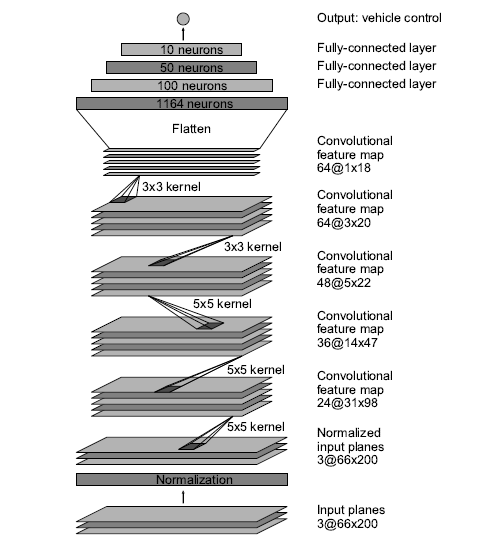
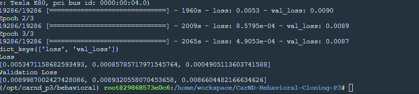

# Behavioral_Cloning
The project aims at cloning the driving behavior

## Objective:

The project aims at cloning the driving behaviour using **Deep Neural networks and Convolutional Neural network**. The model will be developed using **Keras**. The model takes input as images and steering angle from Training mode data and gives output steering angle for captured image.
  
The simulator provided by Udacity shall be used for obtaining training data (Training Mode) and driving a car in Autonomous mode.

## Files:

model.py - script to create and train the model
drive.py - driving the car in autonomous mode
model.h5 - contains data for trained convolution neural network
Video.mp4 - contains final output video

## Model Architecture and Training Strategy

- The model uses a **Linear regression based convolutional neural network**.
- **ReLU** activations are added to create non-linearity.
- The data is normalized using **Lambda layer** available in Keras.
- This **normalization** will reduce the range of values from **-1 to +1** and also will shift mean from **0.5 to 0**.
- Train data : Validation data set splitted in the ratio of **80:20**. Only **3 Epochs** was used to prevent overfitting.
- **Adam Optimizer** was used as an optimizer.
- The centre, left and right images are obtained from dataset.
- The **steering angle for left and right images** are obtained by adding **+0.2 or -0.2** with the current steering angle.
- The images are flipped and added with the existing dataset to get a better training data set. All the data is shuffled before training using the model

## Model Summary:

- A Sequential model was used for training
- A lambda layer was used to normalize the image. Reduce values to +1 to -1 and shift mean from 0.5 to 0
- Crop the top of the images.
- The Nvidia model was used to train the model
- 5 convolutional layers was added after cropping the images
- The images are flattened after the convolutional layers.
- 3 fully connected layers was added after the flattened layers.

The final output was saved using the command model.save('model.h5')

The final loss value after the training is as mentioned below.

